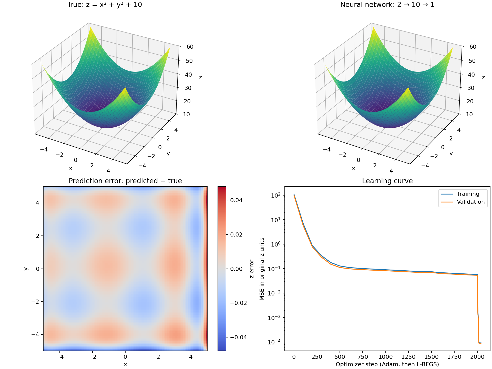

Test repository for Codex Cloud

## 神经网络拟合示例

[neural_fit](neural_fit/README.md) 使用 Python / PyTorch 的 2→10→1 网络拟合
`z = x² + y² + 10`，包含训练代码、依赖版本、训练后的模型、测试指标和结果图。

在 `x,y ∈ [-5,5]` 范围内，2048 个独立测试点的 RMSE 为 0.009773，R² 为 0.99999918。

